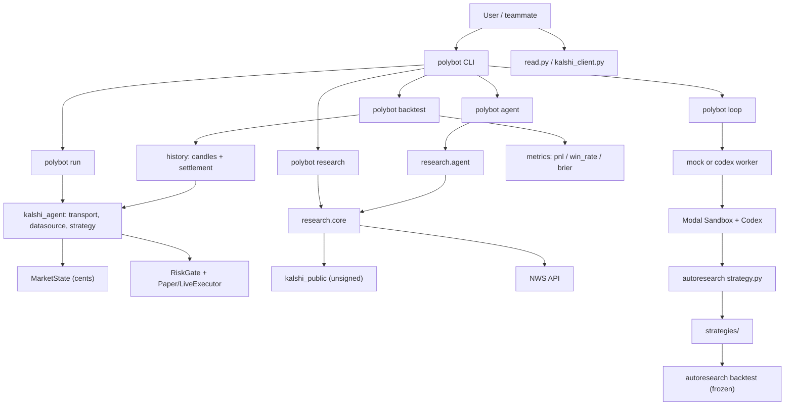

# Polybot Hackathon

Paper-only Kalshi weather-market research demo.

- Layout and commands: [`docs/CODE_LAYOUT.md`](docs/CODE_LAYOUT.md)
- Weather research walkthrough: [`docs/WEATHER_RESEARCH_MVP.md`](docs/WEATHER_RESEARCH_MVP.md)
- Strategy autoresearch: [`docs/STRATEGY_AUTORESEARCH.md`](docs/STRATEGY_AUTORESEARCH.md)
- Modal sandbox spin-up: [`docs/MODAL_SANDBOX_WALKTHROUGH.md`](docs/MODAL_SANDBOX_WALKTHROUGH.md)

## Current Shape

Everything lives under `kalshi_agent/`. Use the **`polybot`** CLI (or `uv run -m kalshi_agent.<module>`).

| Area | Package path | Entry |
|------|----------------|-------|
| Live/paper trading skeleton | `kalshi_agent/` (transport, datasource, strategy, executor) | `polybot run` |
| Signed Kalshi read smoke test | `kalshi_agent/kalshi_client.py` | `polybot read` |
| Weather research + agent | `kalshi_agent/research/` | `polybot research`, `polybot agent` |
| Historical resolved-market backtester | `kalshi_agent/backtest.py`, `history.py`, `metrics.py` | `polybot backtest` |
| Codex autoresearch loop | `kalshi_agent/autoresearch/` | `polybot loop`, `polybot codex` |

Root keeps only **`read.py`** and **`kalshi_client.py`** as thin compatibility shims. Generated strategies go under `strategies/` (gitignored).

## Architecture



## Quick Start

```bash
uv sync
uv run polybot --help

# No network
uv run polybot run

# Signed Kalshi key smoke test (.env.local)
uv run polybot read

# One weather research memo
uv run polybot research --ticker KXRAINNYC-26MAY31-T0

# Modal parallel research
uv run modal run kalshi_agent/research/modal_app.py --tickers KXRAINNYC-26MAY31-T0

# OpenAI Agents coordinator
uv run polybot agent --local "Research KXRAINNYC-26MAY31-T0 and summarize watchlist candidates"

# Resolved-market historical backtest (requires Kalshi keys in .env.local)
uv run polybot backtest --tickers KXRAINNYC-26MAY28-T0

# One offline autoresearch iteration
uv run polybot loop --worker mock --iterations 1
```

All recommendations are paper research only unless you explicitly wire `LiveExecutor` and demo/prod keys.
