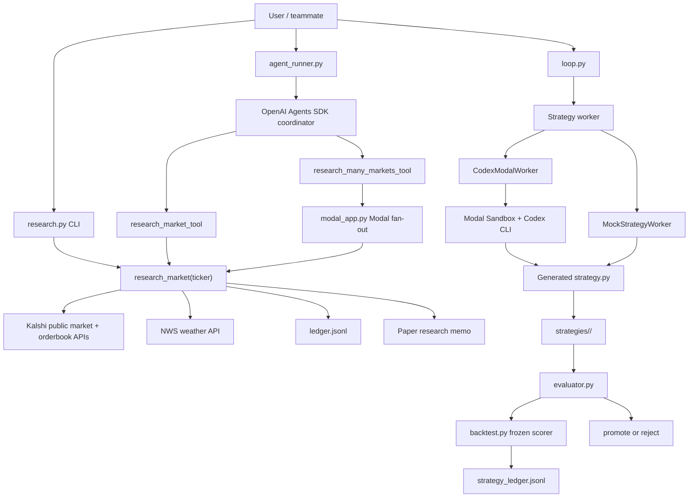

# Polybot Hackathon

Paper-only Kalshi weather-market research demo.

For a deeper walkthrough with code examples, see [`docs/WEATHER_RESEARCH_MVP.md`](docs/WEATHER_RESEARCH_MVP.md).

## Architecture



Two separate OpenAI paths exist:

- `agent_runner.py` uses the OpenAI Agents SDK to coordinate weather-market research tools.
- `codex_worker.py` uses Codex CLI inside a Modal Sandbox to generate candidate `strategy.py` files.

## Code Map

- `research.py` - local weather research pipeline: Kalshi data, NWS data, probability estimate, paper decision.
- `modal_app.py` - runs `research_market(ticker)` across many tickers in parallel on Modal.
- `agent_runner.py` - OpenAI Agents SDK coordinator for research tools.
- `loop.py` - strategy autoresearch orchestrator.
- `codex_worker.py` - mock worker plus Codex-in-Modal strategy author.
- `strategy.py` - current baseline strategy implementing `decide(state)`.
- `strategy_types.py` - shared `MarketState`, `Order`, and `Metrics` contract.
- `backtest.py` - frozen scorer for strategy evaluation.
- `evaluator.py` - train/val evaluation and promotion gate.
- `strategy_registry.py` - saves immutable strategies under `strategies/<strategy_id>/`.
- `ledger.jsonl` - live weather research run log.
- `strategy_ledger.jsonl` - strategy generation/evaluation run log.

## Quick Start

Install dependencies:

```bash
uv sync
```

Run one local market research memo:

```bash
uv run python research.py --ticker KXRAINNYC-26MAY31-T0
```

Run several markets in parallel on Modal:

```bash
uv run modal run modal_app.py --tickers KXRAINNYC-26MAY31-T0,KXRAINNYC-26MAY30-T0
```

Run the OpenAI Agents SDK coordinator:

```bash
uv run python agent_runner.py --local "Research these weather tickers and summarize the best watchlist candidates"
```

For example, include tickers in the prompt:

```bash
uv run python agent_runner.py --local "Research KXRAINNYC-26MAY31-T0 and KXRAINNYC-26MAY30-T0, then summarize the best watchlist candidates"
```

All recommendations are paper research only. The live MVP uses public Kalshi market data plus public NWS forecasts and does not read private keys or place trades.

