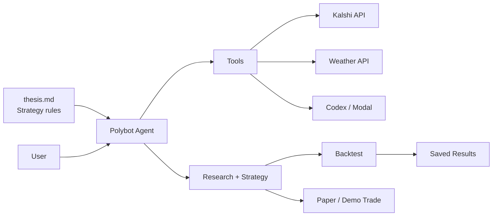

# Polybot Agent Architecture Demo

## Simple Diagram



## What This Shows

Polybot is an agent for researching and testing Kalshi weather-market strategies.
The user starts the system through the `polybot` CLI. The agent reads the rules in
`thesis.md`, uses tools to gather market and weather context, and then produces a
research decision or a candidate strategy.

`thesis.md` is the strategy playbook. It tells the agent what it is allowed to
edit, what risks to avoid, how trades should be evaluated, and why strategies
must be tested on validation data instead of just looking good on training data.

The agent can use Kalshi data, public weather data, and Codex running in Modal to
create or improve strategy code. After a strategy is created, Polybot runs it
through a backtest. Good strategies are saved, while weak strategies are rejected.
Trading is kept to paper or demo mode for safety.

## Demo Commands

Run several Codex/Modal attempts to search for a strategy that can beat the
current promoted baseline:

```bash
uv run polybot loop \
  --worker codex \
  --iterations 5 \
  --codex-app-name polybot \
  --codex-model gpt-5-mini
```

Inspect what happened:

```bash
uv run polybot registry list
cat strategy_ledger.jsonl
```

Dry-run the current promoted strategy against live Kalshi data:

```bash
uv run polybot demo-trade --ticker KXRAINNYC-26MAY31-T0
```

If Kalshi demo keys are configured, place one guarded fake-money demo order when
the promoted strategy returns an order:

```bash
uv run polybot demo-trade --ticker KXRAINNYC-26MAY31-T0 --place-order
```

Run the resolved-market historical backtester from PR #5:

```bash
uv run polybot backtest --tickers KXRAINNYC-26MAY28-T0 --lookback-days 2
```

## Demo Video Talk Track

Use this as the short explanation while showing the diagram:

> This is the high-level Polybot architecture. The key idea is that the agent is
> not just chatting about trades. It has a written thesis in `thesis.md` that acts
> like its rulebook. That file defines what kind of strategy we want, what the
> agent is allowed to edit, and how we avoid overfitting.
>
> The user interacts with Polybot through the CLI. From there, the Polybot agent
> can call tools. It can read Kalshi market data, pull public weather data, and
> use Codex through Modal to generate or improve strategy code.
>
> Once the agent has a strategy, it does not get to grade itself. The strategy is
> sent to a separate backtester and promotion gate. That checks whether the idea
> actually performs after fees, spread, slippage, and validation testing.
>
> If the result is good, Polybot saves it as a candidate strategy. If not, it is
> rejected. The final step is paper or demo trading only, so the system can show
> the full research-to-trade workflow without risking real money.

## One-Sentence Version

Polybot uses a written strategy thesis, market and weather tools, Codex/Modal
strategy generation, and a separate backtester to turn agent research into
paper-tested Kalshi demo strategies.
