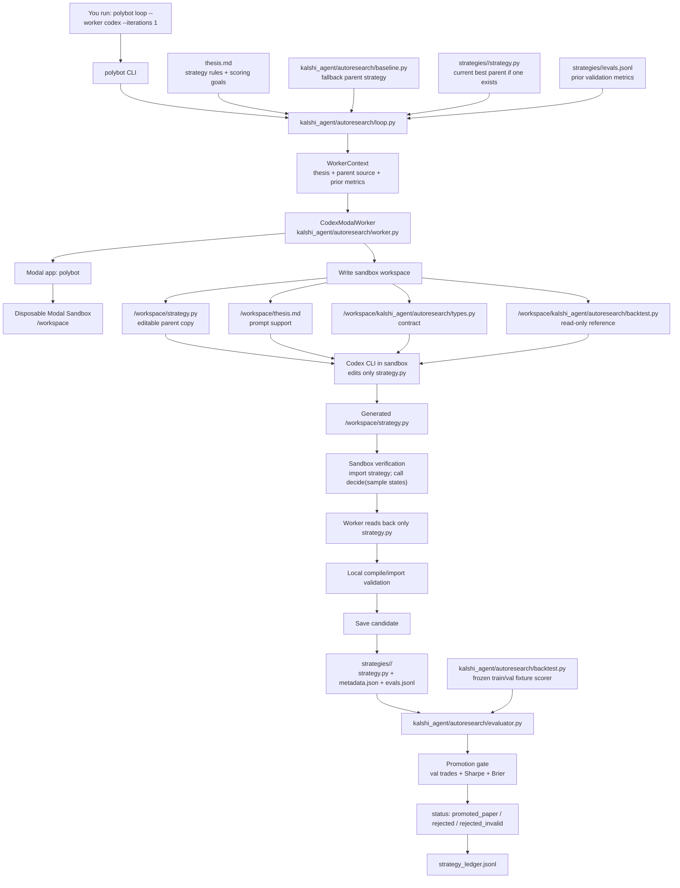

# One Real Autoresearch Iteration

This is the shortest path for running **one real Codex strategy-generation attempt**
inside a Modal Sandbox and seeing how the loop is wired.

## Command

Run from the repo root:

```bash
cd /Users/vishnu/polybot
uv sync

export POLYBOT_CODEX_MODAL_APP=polybot
export POLYBOT_CODEX_MODAL_SECRET=openai-secret

uv run polybot loop \
  --worker codex \
  --iterations 1 \
  --codex-app-name polybot \
  --codex-model gpt-5-mini
```

Watch the sandbox in [Modal polybot/main](https://modal.com/apps/polybot/main)
under **Sandboxes**.

Expected stderr shape:

```text
[codex] Looking up Modal app...
[codex] Creating Modal sandbox...
[codex] Modal sandbox ready.
[codex] Writing strategy workspace files...
[codex] Running Codex in sandbox. This can take a few minutes...
[codex] Reading generated strategy.py...
[codex] Verifying generated strategy in sandbox...
[codex] Verification passed: decide() imports and returns Order|None
[codex] Terminating Modal sandbox...
```

Expected stdout shape:

```json
[
  {
    "iteration": 0,
    "strategy_id": "strategy_...",
    "worker_type": "codex_modal",
    "status": "promoted_paper or rejected",
    "metrics": {
      "train": {},
      "val": {}
    },
    "promotion": {
      "promote": false,
      "reasons": []
    }
  }
]
```

`rejected` is not a failure. It means Codex produced valid strategy code, but the
candidate did not beat the validation promotion gate.

## Architecture



The key boundary: Codex runs in Modal and can only return a new `strategy.py`.
The scorer, registry, promotion gate, and final status update run locally outside
the sandbox.

## Files It Reads

### `thesis.md`

This is the instruction set handed to Codex. It tells the model:

- edit only `strategy.py`
- preserve `def decide(state: MarketState) -> Order | None`
- keep the function pure
- do not touch scorer/evaluator/registry/types
- optimize for validation performance, not train-only performance

The loop reads it here:

```text
kalshi_agent/autoresearch/loop.py
  DEFAULT_THESIS_PATH = Path("thesis.md")
  thesis = thesis_path.read_text(...)
```

The worker embeds the thesis into the Codex prompt:

```text
kalshi_agent/autoresearch/worker.py
  build_codex_prompt(context)
```

### `kalshi_agent/autoresearch/baseline.py`

This is the parent strategy when there is no promoted candidate yet.

If the registry already has a `promoted_paper` strategy, the loop uses that saved
candidate as the parent instead. Otherwise it uses `baseline.py`.

Relevant setup:

```text
kalshi_agent/autoresearch/loop.py
  DEFAULT_BASELINE_PATH = kalshi_agent/autoresearch/baseline.py
  resolve_parent(...)
```

### `kalshi_agent/autoresearch/types.py`

This is the contract Codex-generated strategies must import:

```python
from kalshi_agent.autoresearch.types import MarketState, Order
```

Important: this is separate from `kalshi_agent/types.py`. The autoresearch loop
uses 0-1 float prices; the live agent uses integer cents.

### `kalshi_agent/autoresearch/backtest.py`

This is the frozen fixture scorer used by the Codex loop. Codex gets a sandbox
copy so it can read the contract, but the real scorer is run outside the sandbox
after Codex exits.

Run it directly with:

```bash
uv run polybot autoresearch-backtest --split train
uv run polybot autoresearch-backtest --split val
```

### Modal Secret: `openai-secret`

The sandbox receives `OPENAI_API_KEY` from Modal secret `openai-secret`:

```bash
uv run modal secret create openai-secret OPENAI_API_KEY="$(< keys/openapi_key.txt)" --force
```

The command above only needs to be run when the secret is missing or changed.

## What Happens Internally

1. `polybot loop` dispatches to `kalshi_agent.autoresearch.loop`.
2. The loop reads `thesis.md`.
3. The loop resolves the parent strategy:
   - best saved `promoted_paper` candidate from `strategies/`, or
   - `kalshi_agent/autoresearch/baseline.py` if none exists.
4. The loop builds a `WorkerContext` containing:
   - thesis text
   - parent strategy source
   - parent strategy id, if any
   - prior validation metrics, if any
   - attempt index
5. `CodexModalWorker` creates a Modal Sandbox under app `polybot`.
6. The worker writes a tiny sandbox workspace:
   - `/workspace/strategy.py` from the parent source
   - `/workspace/thesis.md` if present
   - `/workspace/kalshi_agent/autoresearch/types.py`
   - `/workspace/kalshi_agent/autoresearch/backtest.py`
   - compatibility shims `strategy_types.py` and `backtest.py`
7. Inside the sandbox, Codex runs with the thesis and hard rules. It may edit
   only `/workspace/strategy.py`.
8. The worker reads back only `/workspace/strategy.py`.
9. The worker verifies the generated strategy inside the sandbox:
   - imports `strategy`
   - checks `decide` exists and is callable
   - calls `decide` on sample `MarketState`s
   - confirms return is `Order` or `None`
10. The sandbox is terminated.
11. Outside Modal, the loop validates the candidate again locally.
12. The candidate is saved under:

```text
strategies/<strategy_id>/
  strategy.py
  metadata.json
  evals.jsonl
```

13. The evaluator runs train/val fixture backtests with
    `kalshi_agent/autoresearch/evaluator.py`.
14. The promotion gate updates status:
    - `promoted_paper` if validation improves
    - `rejected` if valid but not better
    - `rejected_invalid` if contract/import validation fails
15. The loop appends a summary row to `strategy_ledger.jsonl`.

## Inspect The Result

List saved candidates:

```bash
uv run polybot registry list
```

Inspect a candidate:

```bash
python -m json.tool strategies/<strategy_id>/metadata.json
cat strategies/<strategy_id>/evals.jsonl
```

Inspect the loop ledger:

```bash
cat strategy_ledger.jsonl
```

## Example Run

This is a real run from this repo.

Command used:

```bash
uv run polybot loop \
  --worker codex \
  --iterations 1 \
  --codex-app-name polybot \
  --codex-model gpt-5-mini
```

Sandbox lifecycle output:

```text
[codex] Looking up Modal app...
[codex] Creating Modal sandbox...
[codex] Modal sandbox ready.
[codex] Writing strategy workspace files...
[codex] Running Codex in sandbox. This can take a few minutes...
[codex] Reading generated strategy.py...
[codex] Verifying generated strategy in sandbox...
[codex] Verification passed: decide() imports and returns Order|None
[codex] Terminating Modal sandbox...
```

Loop result:

```json
[
  {
    "iteration": 0,
    "metrics": {
      "train": {
        "brier": 0.2463,
        "max_dd": 0.0,
        "n_trades": 0,
        "pnl": 0,
        "sharpe": 0.0
      },
      "val": {
        "brier": 0.1332,
        "max_dd": 0.0,
        "n_trades": 0,
        "pnl": 0,
        "sharpe": 0.0
      }
    },
    "parent_strategy_id": "strategy_20260530T233243Z_5d18fbf3",
    "promotion": {
      "promote": false,
      "reasons": [
        "Validation trades 0 below minimum 1.",
        "Validation Sharpe 0.0 does not beat current best 0.0."
      ]
    },
    "status": "rejected",
    "strategy_id": "strategy_20260531T002415Z_54233401",
    "timestamp_utc": "2026-05-31T00:24:15+00:00",
    "worker_type": "codex_modal"
  }
]
```

How to read this:

- `Verification passed` means Codex produced importable strategy code with a
  callable `decide()` that returned either `Order` or `None` on sample states.
- `status: rejected` means the generated code was valid, but did not beat the
  promotion gate.
- `n_trades: 0` on both train and val means the candidate was too conservative
  and never placed a paper trade.
- The two `promotion.reasons` explain why it was rejected:
  - it failed the minimum validation-trades requirement;
  - its validation Sharpe did not improve on the current best.
- The candidate was still saved for inspection under:

```text
strategies/strategy_20260531T002415Z_54233401/
  strategy.py
  metadata.json
  evals.jsonl
```

Inspect this exact run:

```bash
python -m json.tool strategies/strategy_20260531T002415Z_54233401/metadata.json
cat strategies/strategy_20260531T002415Z_54233401/evals.jsonl
```

Important distinction: this example used the autoresearch fixture scorer, not the
PR #5 resolved-market historical backtester. To run the PR #5 backtester, use:

```bash
uv run polybot backtest --tickers KXRAINNYC-26MAY28-T0 --lookback-days 2
```

## What This Is Not

This command does **not** place live Kalshi trades.

It also does **not** use the new resolved-market historical backtester
(`polybot backtest`). This Codex loop currently uses the smaller frozen fixture
scorer:

```bash
uv run polybot autoresearch-backtest --split train
```

Use `polybot backtest --tickers ...` separately when you want to score the live
`kalshi_agent/strategy.py` path on resolved Kalshi markets.
