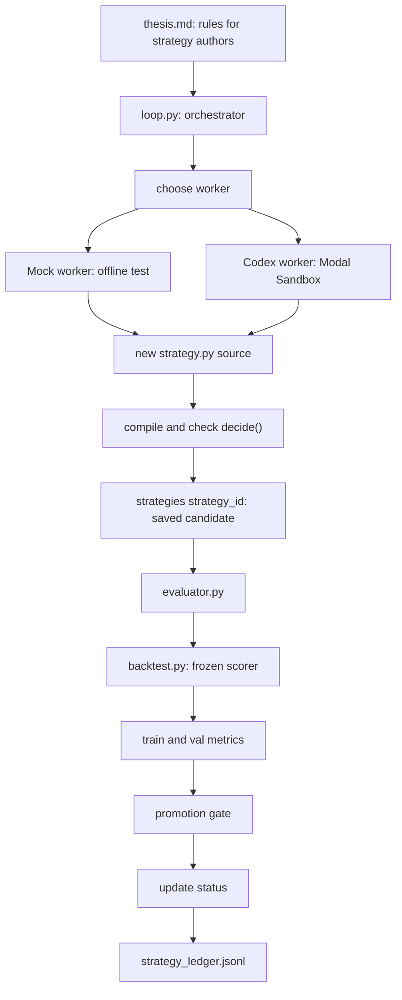

# Strategy Autoresearch System

This document explains the strategy loop that was added on top of the live Kalshi
weather research demo.

Implementation lives under `kalshi_agent/autoresearch/`. Run it with the unified
`polybot` CLI (`polybot loop`, `polybot autoresearch-backtest`, etc.) — see
[`CODE_LAYOUT.md`](CODE_LAYOUT.md).

The goal is simple:

```text
Generate strategy code -> test it honestly -> save the result -> keep only improvements
```

The most important rule:

```text
Codex can write strategy code, but Codex cannot grade that code.
```

The scorer, data, registry, and promotion rules live outside the sandbox and are the
source of truth.

## Start Here

Run these commands from the repo root.

### 1. Test the frozen backtester

```bash
uv run polybot autoresearch-backtest --split train
uv run polybot autoresearch-backtest --split val
uv run polybot autoresearch-backtest --split test
```

What this proves:

- `strategy.py` can be loaded.
- The baseline `decide()` function can trade against fixture data.
- `kalshi_agent.autoresearch.backtest` returns metrics without needing Modal,
  Codex, network, or API keys.

Expected shape:

```json
{
  "brier": 0.2463,
  "max_dd": 0.0,
  "n_trades": 2,
  "pnl": 1.21,
  "sharpe": 7.44
}
```

The exact values may change later as fixtures or strategies change. For now, check
that the command exits successfully and returns `pnl`, `sharpe`, `brier`, `n_trades`,
and `max_dd`.

### 2. Run the full loop without Codex

```bash
uv run polybot loop --iterations 4 --worker mock
```

What this proves:

- The orchestrator loop works.
- A worker can generate candidate strategy code.
- Candidates are saved to `strategies/`.
- The evaluator scores train/val.
- The promotion gate accepts or rejects candidates.
- The run ledger is written to `strategy_ledger.jsonl`.

After it runs, inspect:

```bash
uv run polybot registry list
```

And inspect the run ledger:

```bash
cat strategy_ledger.jsonl
```

Expected behavior:

- The first valid candidate is usually `promoted_paper` because there is no existing
  promoted baseline.
- Later candidates are often `rejected` unless they beat the current validation score.
- This is good. It means the system is not rubber-stamping every generated strategy.

### 3. Dry-run the Codex worker

```bash
uv run polybot codex --worker codex --dry-run
```

What this proves:

- The Codex prompt can be built.
- The Codex worker can be constructed.
- No Modal sandbox is created.
- No API key is used.

You should see a message like:

```text
DRY RUN. Would run: printenv OPENAI_API_KEY | codex login --with-api-key ...; codex exec ... <prompt> < /dev/null
```

Only after these three commands work should you test real Codex in Modal.

## The Mental Model

There are four jobs:

```text
1. Author       Create or mutate strategy.py
2. Registry     Save the exact strategy source and metadata
3. Evaluator    Run train/val backtests and apply the promotion gate
4. Orchestrator Decide what to try next and record what happened
```

The strategy author can be:

- `MockStrategyWorker`: local/offline worker for testing the loop.
- `CodexModalWorker`: real Codex running inside a disposable Modal Sandbox.

The author is intentionally not trusted. It can suggest code, but the host-side
evaluator decides if the code is any good.

## Simple Architecture Diagram



Read it left to right:

1. `thesis.md` tells the worker what is allowed.
2. `polybot loop` starts an iteration.
3. A worker creates new `strategy.py` code.
4. The code is checked for the required `decide()` function.
5. The candidate is saved.
6. The frozen backtester scores it.
7. The promotion gate accepts or rejects it.
8. Results are written to files you can inspect.

## What Each File Does

### `kalshi_agent/autoresearch/types.py`

Defines the shared data contract.

Strategies receive a `MarketState`:

```python
MarketState(
    ticker="KXRAINNYC-TRAIN-YES",
    timestamp_utc="2026-05-01T12:00:00+00:00",
    yes_ask=0.48,
    liquidity=140.0,
    features={
        "market_family": "weather_rain",
        "model_probability_yes": 0.62,
        "resolution_ambiguity": "medium",
    },
)
```

Strategies return either:

```python
Order(side="yes", size=1, limit_price=0.48)
```

or:

```python
None
```

`None` means do not trade.

### `kalshi_agent/autoresearch/baseline.py`

This is the baseline strategy and the shape Codex is allowed to modify.

The key function:

```python
def decide(state: MarketState) -> Order | None:
    ...
```

The current baseline does this:

1. Read `model_probability_yes` from `state.features`.
2. Require a known `yes_ask`.
3. Reject high ambiguity markets.
4. Reject low-liquidity markets.
5. Estimate fees and slippage.
6. Buy YES only if net edge is high enough.

### `kalshi_agent/autoresearch/backtest.py`

This is the frozen scorer.

It should be treated like the scoreboard. Codex should not be allowed to change it.

What it does:

1. Load fixture cases for `train`, `val`, or `test`.
2. Call `strategy.decide(state)` for each case.
3. If there is an order, fill it at the ask.
4. Subtract fees and slippage.
5. Reveal the outcome after the decision.
6. Return metrics.

Important: the strategy never sees `outcome_yes`. Only the backtester sees it.

### `kalshi_agent/autoresearch/registry.py`

This saves strategies permanently.

When a candidate is saved, it creates:

```text
strategies/
  strategy_20260530T205616Z_feac0ace/
    strategy.py
    metadata.json
    evals.jsonl
```

What to look for:

- `strategy.py`: exact source that was evaluated.
- `metadata.json`: author, parent strategy, status, source hash, rationale.
- `evals.jsonl`: one eval result per line.

Status values:

- `candidate`: saved but not finally classified yet.
- `promoted_paper`: passed the promotion gate.
- `rejected`: valid code, but did not beat validation metrics.
- `rejected_invalid`: code did not compile or did not expose `decide()`.

### `evaluator.py`

This loads a saved candidate and scores it.

Use it when you have a strategy id:

```bash
uv run python evaluator.py <strategy_id> --splits train,val
```

It appends results to:

```text
strategies/<strategy_id>/evals.jsonl
```

It also applies the promotion rule.

Promotion rule:

```text
candidate is promoted if:
  validation n_trades is high enough
  validation Sharpe beats the current best promoted strategy
  validation Brier does not degrade too much
```

Train metrics are recorded, but train metrics alone do not promote a strategy.

### `thesis.md`

This is the instruction file for Codex or any other strategy author.

It says:

- Edit only `strategy.py`.
- Keep `decide(state: MarketState) -> Order | None`.
- Do not read secrets.
- Do not edit the backtester.
- Do not use network calls or randomness.
- Optimize validation, not just train.

### `kalshi_agent/autoresearch/worker.py`

This has two workers.

`MockStrategyWorker`:

- Runs locally.
- Does not use Modal.
- Does not use OpenAI.
- Generates simple strategy variants.
- Best for testing the full loop.

`CodexModalWorker`:

- Creates a Modal Sandbox.
- Installs/runs Codex inside that sandbox.
- Copies in `strategy.py`, package support files, compatibility shims, and `thesis.md`.
- Runs `codex exec`.
- Reads back only the modified `strategy.py`.
- Deletes the sandbox.

The important safety point:

```text
Even if Codex edits its sandbox copy of backtest.py,
the official score still runs later on your host copy.
```

### `kalshi_agent/autoresearch/loop.py`

This is the main orchestration command.

Run offline:

```bash
uv run polybot loop --iterations 4 --worker mock
```

Run with Codex in Modal:

```bash
uv run polybot loop --iterations 1 --worker codex
```

Each iteration:

1. Pick the best promoted strategy as the parent, or use baseline `strategy.py`.
2. Ask the worker for new strategy code.
3. Check that code compiles and exposes `decide()`.
4. Save the candidate to `strategies/<id>/`.
5. Evaluate train and val.
6. Promote or reject.
7. Append a row to `strategy_ledger.jsonl`.

### `kalshi_agent/autoresearch/modal_app.py`

This is for parallel scoring and future parallel Codex runs.

Use it after you have saved strategy ids:

```bash
uv run modal run kalshi_agent/autoresearch/modal_app.py --strategy-ids "<id1>,<id2>" --splits train,val
```

It uses Modal Functions for parallel scoring. That is separate from Modal Sandboxes,
which are used for Codex code generation.

## Local Test Path

This path avoids Modal and OpenAI. Use it first.

### Step 1: Compile everything

```bash
uv run python -m py_compile \
  kalshi_agent/autoresearch/types.py \
  kalshi_agent/autoresearch/baseline.py \
  kalshi_agent/autoresearch/backtest.py \
  kalshi_agent/autoresearch/registry.py \
  kalshi_agent/autoresearch/evaluator.py \
  kalshi_agent/autoresearch/worker.py \
  kalshi_agent/autoresearch/loop.py \
  kalshi_agent/autoresearch/modal_app.py \
  strategy_types.py strategy.py backtest.py strategy_registry.py \
  evaluator.py codex_worker.py loop.py modal_strategy_app.py
```

Pass condition:

```text
No output and exit code 0.
```

### Step 2: Backtest the baseline

```bash
uv run polybot autoresearch-backtest --split train
uv run polybot autoresearch-backtest --split val
```

Pass condition:

```text
Both commands print JSON metrics.
```

Check:

```text
n_trades should not be missing.
pnl, sharpe, brier, and max_dd should be present.
```

### Step 3: Run one offline loop

```bash
uv run polybot loop --iterations 1 --worker mock
```

Pass condition:

```text
Command prints a JSON list with one strategy_id and one status.
```

Likely status:

```text
promoted_paper
```

### Step 4: Inspect saved strategy files

```bash
uv run polybot registry list
```

Pick a `strategy_id`, then inspect:

```bash
ls strategies/<strategy_id>
```

Expected files:

```text
strategy.py
metadata.json
evals.jsonl
```

Inspect metadata:

```bash
python -m json.tool strategies/<strategy_id>/metadata.json
```

Inspect eval rows:

```bash
cat strategies/<strategy_id>/evals.jsonl
```

### Step 5: Run more offline iterations

```bash
uv run polybot loop --iterations 4 --worker mock
```

Pass condition:

```text
More strategy directories are created.
strategy_ledger.jsonl gets one row per iteration.
Some candidates may be rejected.
```

That rejection is expected. It means the promotion gate is doing its job.

## Codex + Modal Test Path

Use this only after the local path works.

### Step 1: Create the Modal secret

If your shell has `OPENAI_API_KEY`:

```bash
uv run modal secret create openai-secret OPENAI_API_KEY=$OPENAI_API_KEY
```

If your key is in `.env.local`:

```bash
uv run modal secret create openai-secret --from-dotenv .env.local
```

If you need to overwrite an existing secret:

```bash
uv run modal secret create openai-secret OPENAI_API_KEY=$OPENAI_API_KEY --force
```

The secret must expose this environment variable inside Modal:

```text
OPENAI_API_KEY
```

### Step 2: Dry-run the Codex worker

```bash
uv run polybot codex --worker codex --dry-run
```

Pass condition:

```text
It prints the codex exec command and does not contact Modal.
```

### Step 3: Run one real Codex iteration

```bash
uv run polybot loop --iterations 1 --worker codex
```

First run may be slow because Modal builds the image with Node, npm, and Codex.

Pass condition:

```text
The command creates one strategy candidate and prints its evaluation summary.
```

If you used a different Modal secret name:

```bash
uv run polybot loop --iterations 1 --worker codex --codex-secret-name my-secret-name
```

### Step 4: Inspect what Codex produced

List candidates:

```bash
uv run polybot registry list
```

Open the newest candidate:

```bash
python -m json.tool strategies/<strategy_id>/metadata.json
cat strategies/<strategy_id>/evals.jsonl
```

Read the exact strategy source Codex produced:

```bash
sed -n '1,220p' strategies/<strategy_id>/strategy.py
```

Check:

- Did it only change strategy logic?
- Does it still expose `decide()`?
- Does metadata include a `rationale`?
- Was it `promoted_paper`, `rejected`, or `rejected_invalid`?

## Common Failures

### Modal secret missing

Error:

```text
modal.exception.NotFoundError: Secret 'openai-secret' not found
```

Fix:

```bash
uv run modal secret create openai-secret OPENAI_API_KEY=$OPENAI_API_KEY
```

Then retry:

```bash
uv run polybot loop --iterations 1 --worker codex
```

### Codex command not found inside Modal

This means the image build did not install Codex correctly.

Check `kalshi_agent/autoresearch/worker.py`, especially:

```python
.apt_install("nodejs", "npm")
.run_commands("npm install -g @openai/codex")
```

### Strategy rejected

This is not always an error.

Rejected means:

```text
The strategy was valid code, but it did not beat validation metrics.
```

Inspect:

```bash
cat strategies/<strategy_id>/evals.jsonl
python -m json.tool strategies/<strategy_id>/metadata.json
```

### Strategy rejected_invalid

This means the candidate did not compile or did not expose a callable `decide()`.

Inspect:

```bash
python -m json.tool strategies/<strategy_id>/metadata.json
```

Also read the row in:

```bash
cat strategy_ledger.jsonl
```

## How The Pieces Fit With The Original Weather MVP

The original weather MVP does live research:

```text
kalshi_agent/research/core.py
  -> fetch Kalshi market and orderbook
  -> fetch NWS weather
  -> estimate probability
  -> produce paper decision
```

The strategy autoresearch system does strategy search:

```text
kalshi_agent/autoresearch/baseline.py
  -> consumes MarketState
  -> returns Order or None

kalshi_agent/autoresearch/backtest.py
  -> replays MarketState fixtures
  -> scores strategy decisions
```

`kalshi_agent/autoresearch/backtest.py` intentionally still uses fixtures so the
Codex loop has a small frozen scorer. The real resolved-market backtester from
PR #5 lives at `kalshi_agent/backtest.py` and runs through the live
`strategy.py` / `RiskGate` / `PaperExecutor` path:

```bash
uv run polybot backtest --tickers KXRAINNYC-26MAY28-T0,KXRAINNYC-26MAY29-T0
```

Those two backtesters are separate on purpose: `polybot autoresearch-backtest`
guards generated autoresearch candidates, while `polybot backtest` evaluates the
live strategy over resolved Kalshi markets.

## Minimal End-To-End Example

This uses a temporary registry so it does not leave files behind:

```python
from pathlib import Path
from tempfile import TemporaryDirectory

from kalshi_agent.autoresearch.loop import run_loop
from kalshi_agent.autoresearch.registry import iter_eval_results, list_strategy_candidates

with TemporaryDirectory() as tmp:
    registry = Path(tmp) / "strategies"
    ledger = Path(tmp) / "strategy_ledger.jsonl"

    summaries = run_loop(
        iterations=3,
        worker_name="mock",
        registry_path=registry,
        ledger_path=ledger,
    )

    print(summaries)

    for candidate in list_strategy_candidates(registry):
        evals = iter_eval_results(candidate.strategy_id, registry_path=registry)
        print(candidate.strategy_id, candidate.metadata["status"], len(evals))
```

## What To Remember

The architecture is intentionally conservative:

```text
Codex writes candidate code.
The host saves the exact code.
The frozen backtester scores the code.
The evaluator applies the promotion gate.
The registry preserves the evidence.
```

That is the whole system.

If a strategy is good, we can explain why it was promoted. If it is bad, we still
keep the source, rationale, and evals so we can learn from it.
